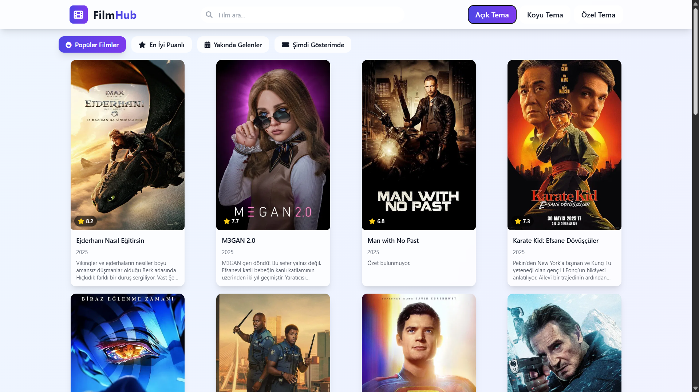
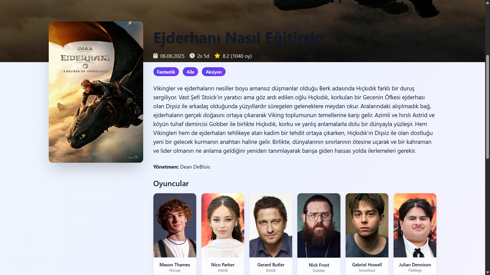
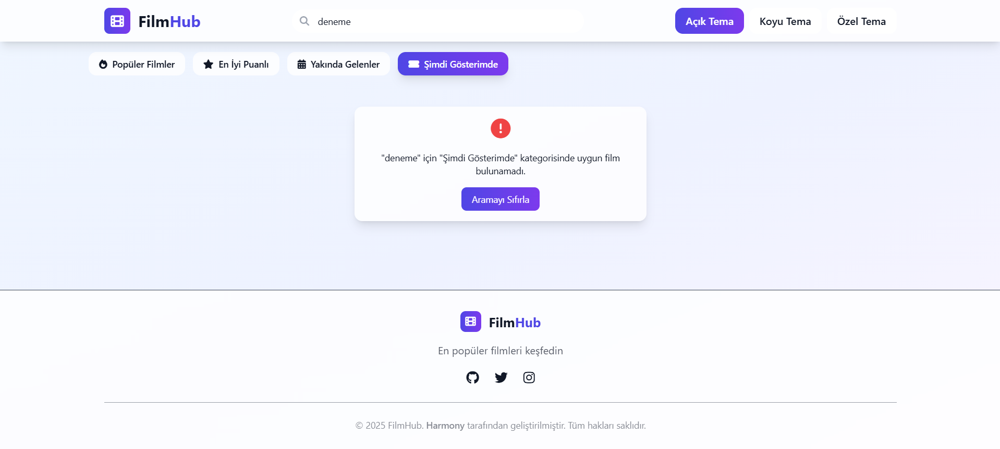

# FilmHub

FilmHub, popüler filmleri keşfetmek, kategorilere göre filtrelemek ve detaylı bilgilere ulaşmak için geliştirilmiş bir React tabanlı web uygulamasıdır. [The Movie Database (TMDB) API](https://www.themoviedb.org/) kullanılarak güçlendirilmiştir. Kullanıcı dostu arayüzü, responsive tasarımı ve karanlık/aydınlık tema desteği ile modern bir film keşif deneyimi sunar.

## Özellikler
- **Popüler Filmler ve Kategoriler**: Popüler, en iyi puanlı, yakında gelen ve şimdi gösterimde olan filmleri keşfedin.
- **Arama**: Film adına göre arama yapın ve kategorilerle filtreleyin.
- **Kullanıcı Dostu Hata Mesajları**: Türkçe ve anlaşılır hata mesajları (ör. "Aradığınız film bulunamadı").
- **Responsive Tasarım**: Mobil, tablet ve masaüstü cihazlarda sorunsuz çalışır.
- **Karanlık/Aydınlık Tema**: Tema geçişi ile kişiselleştirilmiş deneyim.
- **SEO ve Erişilebilirlik**: Türkçe meta etiketler, Open Graph ve Twitter Card desteği.
- **Hızlı Yükleme**: Optimize edilmiş API çağrıları ve görüntü yüklemeleri.

## Ekran Görüntüleri




## Kurulum
1. **Depoyu Klonlayın**:
   ```bash
   git clone https://github.com/developerharmony/FilmHub.git
   cd FilmHub
   ```

2. **Bağımlılıkları Yükleyin**:
   ```bash
   npm install
   ```

3. **Ortam Değişkenlerini Ayarlayın**:
   - `public` klasöründe bir `.env` dosyası oluşturun.
   - TMDB API anahtarınızı ekleyin:
     ```bash
     echo "REACT_APP_TMDB_API_KEY=your_api_key_here" > .env
     ```
   - TMDB API anahtarı almak için: [TMDB API](https://www.themoviedb.org/documentation/api).

4. **Uygulamayı Çalıştırın**:
   ```bash
   npm start
   ```
   - Uygulama varsayılan olarak `http://localhost:3000` adresinde çalışır.

5. **Derleme (Opsiyonel)**:
   ```bash
   npm run build
   ```
   - Derlenmiş dosyalar `build` klasörüne kaydedilir.

## Kullanım
- **Ana Sayfa**: Popüler filmleri görüntüleyin veya kategoriler arasında geçiş yapın (Popüler Filmler, En İyi Puanlı, Yakında Gelenler, Şimdi Gösterimde).
- **Arama**: Arama çubuğuna film adı yazarak arama yapın. Kategorilerle filtreleme için bir kategori seçin.
- **Film Detayları**: Bir filme tıklayarak detay sayfasına gidin (poster, özet, oyuncular, fragman).
- **Tema Değiştirme**: Sağ üstteki butonla karanlık/aydınlık tema arasında geçiş yapın.

## Teknolojiler
- **React**: Kullanıcı arayüzü için.
- **Tailwind CSS**: Stil ve responsive tasarım.
- **TMDB API**: Film verileri.
- **React Router**: Sayfa yönlendirmeleri.
- **Font Awesome**: İkonlar.

## Katkıda Bulunma
1. Depoyu fork edin.
2. Yeni bir dal oluşturun: `git checkout -b feature/yeni-ozellik`.
3. Değişikliklerinizi yapın ve commit edin: `git commit -m "Yeni özellik eklendi"`.
4. Dalı push edin: `git push origin feature/yeni-ozellik`.
5. Pull Request (PR) açın.

## Lisans
Bu proje [MIT Lisansı](LICENSE) ile lisanslanmıştır.

## İletişim
- **GitHub**: [developerharmony](https://github.com/developerharmony)
- **E-posta**: <a href="mailto:dev.harmony1@gmail.com">Bana Mail Gönderin</a>

FilmHub ile sinema dünyasını keşfedin! 🎬